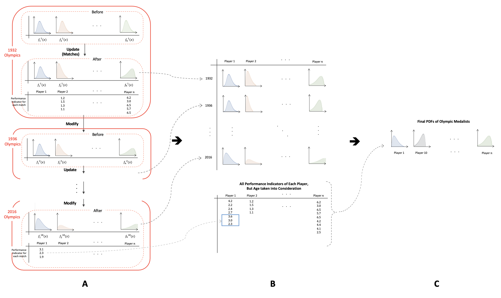

# PAPERS V2: Probabilistic Athlete Performance Evaluation & Ranking Software V2

## Introduction and Motivation
The motivation behind creating this software was mostly to rank individual fencers based on their performance based on rudimentary data. Although there has been a surge in the usage of physiologic and movement data for analyzing athletic performance driven by the growth of the wearable device industry, such technology is not widely available due to cost, and thus there exists vast difficulties in recording and analyzing data. 

That justifies half of the motivation. But why fencing? Well, first of all, the 2024 Paris olympics are coming up, and they plan to hold the fencing matches in this beautiful stadium. How could we not talk about fencing? 

  
   Ah, I love France.

Also, with COVID striking the world a few years ago, I thought the tech world, one of the sectors hit the hardest by COVID, just have to pay fencing a sort of tribute for being the most sensible sport. Everyone wears masks, gloves, and stabs whoever that fails to socially distance. 

  
   Fig 1. The intricate relationship between fencing and COVID

So, why not fencing? 

Thus, me and my friends had wrote a paper (available [here](https://www.seanyoonbio.com/_files/ugd/577e3b_44a7ff922f504a058afc60882d9b4f12.pdf)) on developing a holistic athlete ranking algorithm, and this software is drawn from this paper. This version, however, contains some updates from the paper to increase usability (memory efficiency, runtime, etc), and model accuracy. Also, while the initial model had been developed to find a time-independent GOAT (Greatest of All Time), this model has undergone some changes to accord greater weight on current performance. 

On an additional note, although it had been developed for fencing, it can be used for any individually played sport. 

## More serious stuff
So, how does the software work? Below is an illustration of the ideas behind the paper. 

  
   Visualization of the Model

Three key ideas behind the paper are: (1) a probability distribution assigned to each athlete to represent performance, (2) a holistic performance indicator for each match, and (3) an iterative observation and non-observation update process. 

Firstly, a probability distribution with a Gaussian prior and likelihood is assigned to each athlete to quantify performance, instead of a single value as in most models. 

For each match, both athletes are given a "performance indicator," a value bounded between 0 to 2 to assess the performance of the athlete in that match. This indicator takes the athlete's win/loss, score difference, and difficulty of the opponent. 

Then, the model undergoes an iterative process to update the probability distributions during each observation process (season, competition, etc) followed by a subsequent non-observation process (caused by non-season, injury, etc). The observation updates are based on a Bayesian model, while the non-observation process is done by decaying the parameters of the probability distributions. This addresses a common challenge in current models, which is that they cannot account for rankings across multiple competitions or seasons.

## Usage 
The software will return three pdf files in a specified directory, with a randomly generated SLURM-job-id-esque 'unique_id' to avoid confusion: 
- 'rankings_[unique id].pdf': The rankings of each athlete and their overall performance indicators. 
- 'performance_graphs_[unique id].pdf': The performance graphs for each observation period. 
- 'performance_values_[unique id].pdf': The performance values for each athlete across observation periods. 

## Example Results 
This repository also contains two example datasets under the directory 'example_outputs', which are from men's epee Olympic results from 1932 to 2016, and women's foil world championship results from 2014 to 2021 (the women's dataset was from this [Kaggle dataset](https://www.kaggle.com/datasets/amichaelsen/fie-fencing-womens-foil-data)). 

As an example, this a ranking of the top 12 athletes in the women's foil world championship results from this model, featuring a few of the world's greatest fencers and Kiefer Lee, the current foil world champion.  

|Rank| Athlete Name              | Average Performance   |
|:--:|:-------------------------:|----------------------:|
|1   | VEZZALI Valentina         | 1.7234460489484567    |
|2   | LUAN Jujie                | 1.665638345813813     |
|3   | PALM Kerstin              | 1.5630608026552961    |
|4   | RODIONOVA Inessa          | 1.5475675205685937    |
|5   | KOROBEYNIKOVA Larisa      | 1.5334254138823327    |
|6   | ERRIGO Arianna            | 1.52210614397329      |
|7   | WAECHTER Katja            | 1.4938356135501731    |
|8   | MAMEDOVA Aila             | 1.4621288070949765    |
|9   | WELTZIEN Silke            | 1.4492559058235386    |
|10  | HILGERS Britta            | 1.4489876062703917    |
|11  | DEMAILLE Marie Chantal    | 1.4233705516413548    |
|12  | KIEFER Lee                | 1.4222100381695792    |

## Setup
To use the software, 
1. Clone the repository onto your local machine: 
'''
git clone git@github.com:seanyoon777/PAPERS.git PAPERS
'''
You can replace the PAPERS with any directory path of your choice. 

2. Now, set up the Conda environment. Most of the requirements are widely used packages, such as scipy or pandas, except "fpdf". So run either 
'''
conda install -c conda-forge fpdf
'''
or 
'''
conda env create -f environment.yml
'''
and run 
'''
conda activate papers
'''

3. Navigate into the current directory. 

4. The input data should be a csv file with seven columns: 'Year', 'Player1', 'Country1', 'Player2', 'Country2', 'Score1', 'Score2'. 'Year' is the year the match had taken place, and 'Player1' and 'Player2' is the player name or equivalent uniquely identifiable name. 'Score1' and 'Score2' are scores for each player in the given match. 'Country1' and 'Country2' should be the country codes for players, although it is only for player identification purposes. 

5. To use the model, run the below command on your terminal: 
'''
python main.py -f [directory of your csv file] -d [directory you want the pdf files to be created in]
'''
